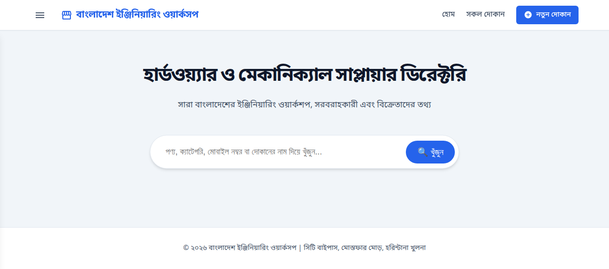
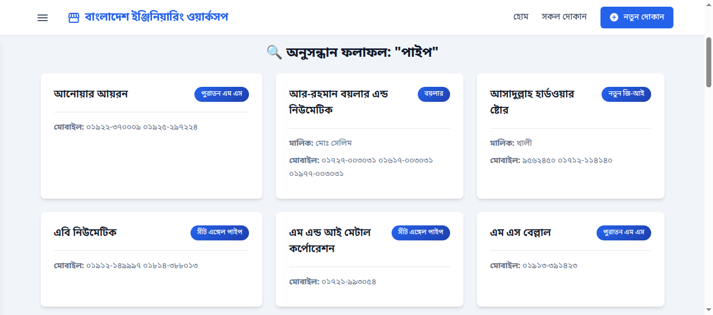
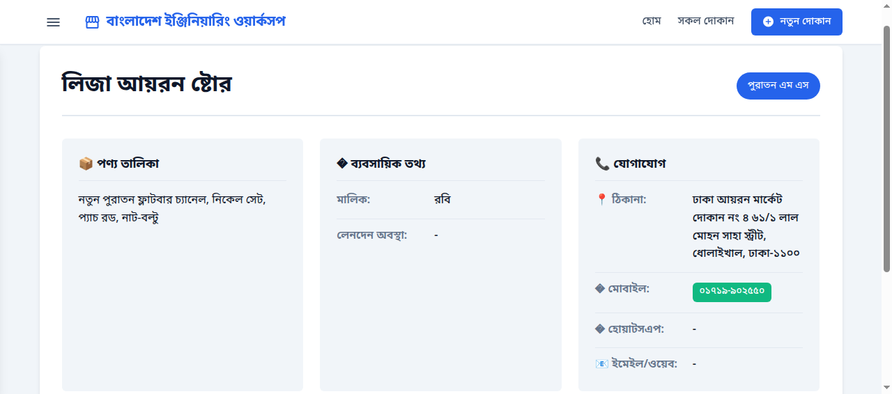
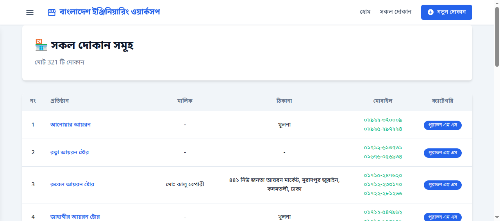

# BD Business Directory

A robust Python Flask application designed to manage and display a directory of businesses. This application utilizes a SQLite database for efficient data storage and offers a user-friendly web interface for searching, viewing, and managing shop details.

## Features

- **Search Functionality**: Easily search for shops by name, area, or category.
- **Detailed Views**: View comprehensive details for each business, including contact info and address.
- **Category Management**: Organize businesses into categories.
- **Responsive Design**: Clean and modern UI that works across devices.

## Screenshots

### Main Interface


### Search Results


### Shop Details


### All Shops View


## Installation and Setup

1.  **Clone the repository:**
    ```bash
    git clone https://github.com/mdnaimul22/bd_business_dir.git
    cd bd_business_dir
    ```

2.  **Install Dependencies:**
    Ensure you have Python installed. Install the required packages (create a virtual environment if preferred):
    ```bash
    pip install flask sqlalchemy
    # Add other dependencies if they exist in requirements.txt
    ```

3.  **Run the Application:**
    ```bash
    python app.py
    ```

4.  **Access the App:**
    Open your web browser and navigate to `http://127.0.0.1:5000`.

## Structure
- `app.py`: Main Flask application entry point.
- `database.py`: Database models and connection logic.
- `templates/`: HTML templates for the web interface.
- `static/`: CSS and JavaScript files.
- `docs/`: Documentation and images.
